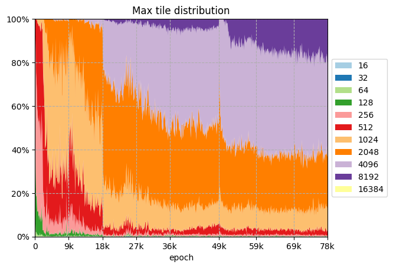
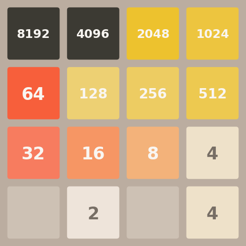

ML2048 - Train AI to play 2048
-------------------------------

# Result

The trained agent achieved 2048 over 85% games and
outperformed similar Q-learning / policy gradient approaches as of writing.

There is rare chance (&lt;0.1%?) to reach 16384 but the moves somehow seem surprisingly lucky.

# Brief description

The project trains an agent to play the famous game [2048][2048] with deep reinforcement learning.

The model training is based on
* Actor-Critic Algorithm
* Proximal Policy Optimization
* Generalized Advantage Estimation
* Convolutional neural network frontend shared by actor and critic
* Performant vectorized environment
* Fine-tuning hyperparameters over epochs

See [visualization.ipynb](notebooks/visualization.ipynb) to run the trained agent.

Start with [run_train3.py](run_train3.py) to explore the ~~messy~~ training code:
- [_network.py](src/ml2048/policy/_network.py) for the CNN network.
- [actor_critic.py](src/ml2048/policy/actor_critic.py) the PPO implementation
- [game_numba.py](src/ml2048/game_numba.py) the vectorized game environment, `VecGame`

## The network

The [2048][2048] game consists of a 4x4 grid
and there are at least 16 possibilities in each cell (empty, 2, 4, 8, up to 131072).

Here the board is one-hot encoded and fed into CNN.
Since the input is sparse, it is convoluted depthwisely with 1x4, 4x1, and 4x4 kernels separately,
which the agent hopefully learns horizontal, vertical, and overall grid information.
The intermediate result is then pointwisely convoluted, concatenated, convoluted again
to output the required number of features to actor and critic layers.

The 1x4/4x1 kernel idea popped up when rewriting the environment for speed.
The agent should consider the whole rows/columns when deciding actions.
The 4x4 kernel was added as redundancy.

The actor and critic layers are usually MLP with 2 hidden layers.
They outputs 4 logits and 1 state value respectively.

[1]: https://iclr-blog-track.github.io/2022/03/25/ppo-implementation-details/

# Remarks

01. The experience buffer is step-based instead of episode-based.
    There are `M` individual games and they are stepped `N` times in each epoch
    to obtain `MN` transitions.
    They are reset to the initial state when terminated.

00. Each transition `(S, A, R, S)` is used twice in current and next epoch
    to stabilize policy update.

00. Initially, 65536 transitions were fed into the network every epoch.
    It took roughly 30 minutes to iterate 1k epochs on a recent mid-range machine with GPU.
    Later, the number was doubled since the machine seemed unstressed. 😎

    The model was trained with at least 5B transitions,
    or approximately 1.7M games with average steps of 1500.

00. The depthwise convolution outputs more channels than input,
    and there is likely more computation,
    compared to the usual depthwise-separable convolution.

00. Batch norm harmed the performance and was thus removed.

00. As [suggested][1], weights are orthogonally initialized.
    All bias is initialized to zero, which deactivates ReLU by default when the input is sparse.
    Otherwise, the bias is likely a positive constant to the network
    until new number is seen (in one-hot encoding), which the network must greatly adjust itself.

00. The actor logits subtract their max values to avoid `+inf` and `NaN`.

00. Invalid actions are filtered. The probability distribution is adjusted based on valid actions.

00. Advantage is normalized to mostly fit into `[-1, 1]` range
    to avoid extreme values and clipping.

    It does not sound good when subtracting the mean from the advantage.
    The standard deviation is computed under the assumption of zero mean instead.
    The mean itself is usually close to zero (compared to std in magnitude) though.

00. Entropy coefficient is reduced before the mid game, which may not be critical.

00. From practice, it is good idea to maintain the magnitude of entropy loss two order (base 10)
    less than policy loss.

00. The peaks (9k, 18k, 27k, 49k, etc) in the max tile distribution chart were caused
    by applying different hyper-parameters.

    In epoch 18k, the agent improved dramatically.
    Apart from decrease of learning rate,
    both entropy coefficient and critic coefficient were divided by 10,
    which probably reduced resistance due to entropy term.

    In epoch 49k, potential-based reward shaping is used to grant extra bonus to the top left cell.
    Before that, the model preferred the largest tile located in the second to the top left cell.
    The agent adapted the new reward scheme and improved max tile distribution.

00. Evaluating agent performance in step-based training with vectorized environment is tricky.

    Firstly, the trajectory in training is partial.
    Evaluation must be carried separately to obtain complete episodes.

    Secondly, the first `N` terminated games is not the first `N` games.
    Incorrect implementation may cause bias toward early ended games.

00. There are better approaches to solve the 2048 puzzle rather than Q-learning / policy gradient method.
    For example, n-tuple network, and expectimax optimization.
    Monte Carlo tree search (MCTS) seems useful but this work did not include it.

# Bibliography
- Schulman, John, et al. "Proximal policy optimization algorithms." arXiv preprint arXiv:1707.06347 (2017).
- Schulman, John, et al. "High-dimensional continuous control using generalized advantage estimation." arXiv preprint arXiv:1506.02438 (2015).
- Ng, Andrew Y., et al. "Policy invariance under reward transformations: Theory and application to reward shaping." Icml. Vol. 99. 1999.
- Weng, Lilian. ["Policy Gradient Algorithms"](https://lilianweng.github.io/posts/2018-04-08-policy-gradient), lilianweng.github.io, 2018.
- Achiam, Josh, et al. ["Spinning Up in Deep RL"](https://spinningup.openai.com/en/latest/).
- Huang, et al., ["The 37 Implementation Details of Proximal Policy Optimization"](https://iclr-blog-track.github.io/2022/03/25/ppo-implementation-details/), ICLR Blog Track, 2022.
- Guei, Hung. "On Reinforcement Learning for the Game of 2048." arXiv preprint arXiv:2212.11087 (2022).
- Li, Shilun, and Veronica Peng. "Playing 2048 With Reinforcement Learning." arXiv preprint arXiv:2110.10374 (2021).
- ["What is the optimal algorithm for the game 2048?"](https://stackoverflow.com/questions/22342854/what-is-the-optimal-algorithm-for-the-game-2048), 2014.

[2048]: https://gabrielecirulli.github.io/2048/

